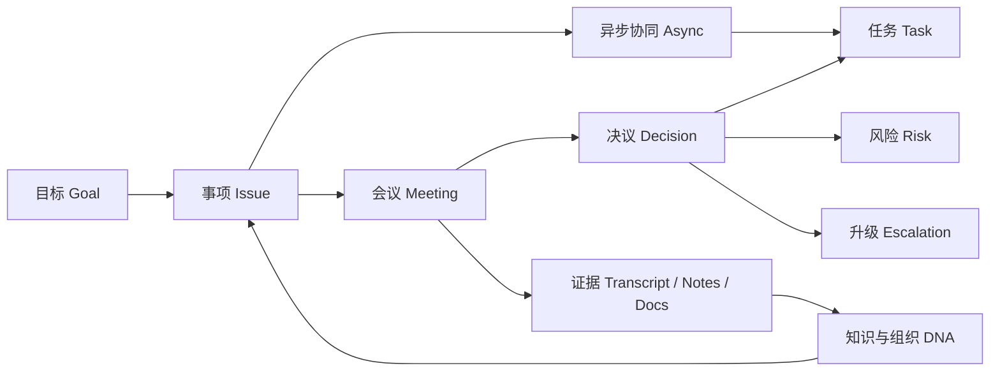

# 易语会议效率导向重构规范

> 适用范围：当前独立测试页 `/meeting-system/`，以及后续接入“易语大平台”的会议与推进模块  
> 文档类型：可执行重构规范  
> 面向对象：产品、交互、视觉、前端  
> 文档目的：让系统从“会议记录系统”转向“事项推进工作台”，让会前、会中、会后都服务于效率，而不是服务于记录

---

## 1. 一句话结论

当前这套页面已经有“组织级会议管理”的基础，但核心对象仍然偏向“会议”和“系统状态”，还没有彻底切到“事项推进”和“行动转化”。

下一轮重构的关键，不是把页面做得更漂亮，而是把整个产品的重心改成：

**不是为了记录会议，而是为了减少低效会议、提高决策质量、自动推动事项落地。**

---

## 2. 重构目标

本次重构必须同时达成下面五个目标：

1. 用户打开首页后，5 秒内知道“现在最该处理什么”。
2. 用户能区分“哪些事不需要开会，异步就能解决”。
3. 开会前能暴露资料缺口、议题发散和责任不清的问题。
4. 开会中只保留待拍板问题、分歧点和决策，不让页面变成信息搬运现场。
5. 会后自动把决议转成任务、风险、升级项和下次会议承接事项。

不追求的目标也要明确：

- 不是把所有会议材料都堆到一个更大的仪表盘里。
- 不是单纯美化现有六个页面。
- 不是强化“秘书视角”的记录功能。
- 不是让用户进来先看系统状态、角色和规则说明。

---

## 3. 当前页面的核心问题诊断

基于当前独立测试页的首页壳层、首页仪表盘和会议中心实现，问题集中在以下六类。

### 3.1 首页还是“系统总览”，不是“行动入口”

当前首页第一眼看到的是：

- 大标题和描述
- 后端会话状态
- 角色信息
- 系统要求
- 发布闸门
- 六个并列入口
- 指标卡和分析卡

这更像“系统首页”，而不是“今天该做什么”的工作台。

### 3.2 顶部区域承担了太多后台信息

当前顶部区域承载了不少后台和规则信息：

- 后端会话是否连接
- 当前角色
- 证据可追溯
- 发布闸门

这些信息不是没用，但它们不应该占据首页最贵的位置。首屏最贵的位置应该给：

- 待处理事项
- 待准备会议
- 待确认决议
- 逾期任务
- 需要升级的问题

### 3.3 六个模块现在是“并列关系”，不是“主次关系”

当前导航里：

- 首页仪表盘
- 目标地图
- 会议中心
- 任务中心
- 组织 DNA
- 知识与资料

都被做成同样重要的入口，这会让用户产生一个错误印象：

> 每个模块都同样重要，所以我需要自己判断先去哪。

但真实工作中不是这样。真正高频的是：

- 现在要推进什么
- 哪场会要准备
- 哪些决议没落地
- 哪些事项卡住了

### 3.4 指标可看，但动作不够直接

例如“会议总数”“待执行任务”“开放风险”“待确认歧义”这些指标本身没有问题，但还不够像动作入口。用户看到之后容易产生一个问题：

> 然后呢？我该怎么处理？

好的首页模块必须能回答两件事：

1. 为什么这块重要。
2. 点进去立刻能处理什么。

### 3.5 会议中心仍然偏流程机，而不是决策场

当前会议中心已经具备完整流程闭环，但视觉重心仍偏向：

- 生成会前包
- 导入原文
- 触发抽取
- 运行流程
- 列表切换

这对演示系统能力很有帮助，但对于真实开会的人来说，核心问题是：

- 哪些事值得开会
- 会前缺什么
- 会中还缺哪几个关键决策
- 会后哪些项没有转成动作

### 3.6 视觉干净，但信息引导还不够强

当前页面的视觉方向是克制的，这一点是好的，但“干净”不等于“清晰”。

现在更接近：

- 白底卡片很多
- 卡片样式相似
- 分析块、提醒块、导航块权重接近

结果是用户很难一眼分辨：

- 什么必须处理
- 什么正在推进
- 什么只是背景分析

---

## 4. 核心产品模型要改成什么

本系统的中心对象必须从“会议”调整为“事项”。

### 4.1 核心对象模型



这个模型要表达四个意思：

1. 会议不是起点，事项才是起点。
2. 会议不是唯一处理方式，很多事项应该先异步协同。
3. 会议的价值不是留下记录，而是形成决议、任务、风险和升级动作。
4. 知识、纪要、转写、组织 DNA 都是支撑事项判断的底座，不是前台主角。

### 4.2 四条产品原则

后续所有页面和功能都必须服从这四条原则：

1. **不是为了记录会议。**  
   记录是底座，不是目标。
2. **能异步就不开会。**  
   会议应该留给需要同步判断、拍板和协调的事项。
3. **会中只做决策，不做信息搬运。**  
   会前必须尽可能把材料和背景准备完。
4. **会后必须自动转成推进动作。**  
   任何没有变成任务、风险、升级项或承接事项的决议，都视为没有完成闭环。

---

## 5. 新的信息架构建议

当前六个页面不建议继续以完全并列方式存在。建议改成“前台高频工作入口 + 后台支撑入口”的结构。

### 5.1 推荐一级导航

1. 推进工作台
2. 事项池
3. 会议台
4. 行动中心
5. 知识与证据

### 5.2 推荐二级入口

- 目标地图
- 组织 DNA
- 审计与规则
- 搜索结果页

### 5.3 现有页面的迁移映射

| 当前页面 | 建议名称 | 新定位 |
|---|---|---|
| `meeting-dashboard` | 推进工作台 | 主首页，动作优先，分析后置 |
| `meeting-center` | 会议台 | 会前 / 会中 / 会后闭环，不再是流程展示页 |
| `task-center` | 行动中心 | 决议、任务、风险、阻塞、升级 |
| `knowledge-hub` | 知识与证据 | 资料、证据、搜索、历史上下文 |
| `goal-map` | 目标地图 | 二级视图，承担管理分析 |
| `org-dna` | 组织 DNA | 二级视图或后台支撑能力，不占高频入口 |

### 5.4 为什么要新增“事项池”

因为“事项”是整个系统真正的工作对象，但在当前页面结构里，它没有独立位置。

事项池要承担的不是“又一个列表页”，而是组织的推进分流器。它要回答：

- 这个问题值不值得开会？
- 这个事项现在缺的是信息、决策、执行还是协同？
- 这个事项应该进异步、进会议、进升级，还是直接归档？
- 这个事项与哪个目标、哪个风险、哪场会、哪些任务有关？

如果没有“事项池”，系统就还是会回到“以会议为中心”的旧路径。

---

## 6. 页面级重构方案

## 6.1 推进工作台

### 页面目标

让用户一进来就知道：现在最该处理什么，下一步点哪里，哪些事情不能再拖。

### 首屏必须回答的四个问题

1. 我今天 / 本周要处理的最重要事项是什么？
2. 接下来要开的会准备得够不够？
3. 哪些决议还没变成行动？
4. 哪些事项偏航或需要升级？

### 推荐首屏结构

```text
顶部控制条：标题 / 时间范围 / 组织或部门筛选 / 全局搜索 / 快速动作

第一层：今日 / 本周必须处理
[待准备会议] [待确认决议] [待补全歧义] [逾期任务] [需升级事项]

第二层：会议推进带
[即将召开] [进行中] [待发布] [追踪中]

第三层：决议落地带
[决议转任务漏斗] [任务老化] [跨部门阻塞] [回滚到下次会议]

第四层：分析带
[目标健康] [风险热力] [部门协同偏航] [AI 建议]
```

### 要保留的内容

- 异常提醒
- 待确认歧义
- 任务老化
- 风险面板

### 要降级的内容

- 会话连接状态
- 角色展示
- 系统要求
- 发布闸门说明
- 大段方法论描述

### 设计要求

- 第一屏最多只放 5-7 条必须处理项。
- 每个模块必须有明确动作按钮，例如“去准备”“去确认”“去升级”“去补全”。
- 分析类内容必须压到首屏之下，不得抢占待办入口的位置。

---

## 6.2 事项池

### 页面目标

把“该不该开会”和“这个问题现在该怎么推进”变成一个清晰、可分流、可追踪的判断界面。

### 页面应该承接的对象

- 新提交的问题
- 来自会议抽取的未闭环事项
- 来自任务回退的阻塞事项
- 来自风险升级的跨部门事项
- 需要补充资料的待判断事项

### 页面结构建议

1. 顶部：事项状态切换
   - 待判断
   - 建议异步
   - 建议上会
   - 推进中
   - 已升级
   - 已闭环

2. 中部：事项列表
   - 事项标题
   - 所属目标
   - 当前负责人
   - 建议处理方式
   - 风险等级
   - 最近一次推进时间

3. 右侧或详情抽屉：事项决策面板
   - 背景摘要
   - 关联资料
   - 是否需要开会
   - 如果开会，建议进入哪种会议
   - 如果不开会，建议异步推进路径
   - 当前缺失信息

### 页面核心动作

- 新建事项
- 标记为可异步解决
- 标记为必须上会
- 指定下一次会议承接
- 直接转任务
- 升级为跨部门阻塞
- 归档

### 关键判断规则

- 信息不全的事项，先补资料，不直接进会。
- 无明显分歧、只需同步执行的事项，优先异步。
- 需要跨部门拍板、资源协调或高风险判断的事项，才进入会议。

---

## 6.3 会议台

### 页面目标

把会议从“流程操作界面”改成“决策收敛界面”，让会前、会中、会后都围绕效率设计。

### 页面结构必须重排为三段

1. 会前
2. 会中
3. 会后

### 会前区要突出什么

- 本场会要解决的事项
- 会前资料是否齐全
- 哪些议题根本不该上会
- 哪些议题还缺背景、缺负责方、缺目标关联
- 建议议程顺序和预估时长

### 会中区要突出什么

- 当前只展示待拍板事项
- 每个事项的关键信息只保留三块：
  - 事实与证据
  - 分歧点
  - 需要谁拍板
- 支持快速形成“决议卡片”
- 记录争议而不是复述全量纪要

### 会后区要突出什么

- 自动抽取后的决议草稿
- 未补全字段列表
- 发布闸门未通过项
- 已转任务、已转风险、已转升级项
- 下次会议承接事项

### 当前页面里要降级的内容

- 各类流程按钮堆叠在主区域
- “技术已运行到哪一步”的展示权重
- 以“导入原文”为主的视觉中心

### 当前页面里要保留的底层能力

- 会前包生成
- 会议原文或纪要导入
- 抽取与消歧
- 发布写回
- 飞书同步

### 推荐会中主界面结构

```text
左侧：本场会议事项列表
中间：当前事项决策区
右侧：决议草稿 / 行动项 / 风险 / 升级项
底部：证据与原文定位
```

---

## 6.4 行动中心

### 页面目标

让“会后有没有真的动起来”一眼可见，避免任务页沦为普通待办列表。

### 页面要承接的对象

- 决议
- 行动项
- 风险项
- 阻塞项
- 升级项

### 页面结构建议

1. 顶部切换：
   - 待确认
   - 已分配
   - 执行中
   - 已逾期
   - 已阻塞
   - 已验收

2. 主表格或泳道：
   - 事项 / 决议来源
   - 负责人
   - 截止时间
   - 完成标准
   - 当前状态
   - 是否跨部门
   - 是否关联风险

3. 重点模块：
   - 跨部门阻塞
   - 长时间未更新
   - 已开会但未落地
   - 回滚到下次会议

### 页面必须支持的动作

- 补全负责人
- 补全截止时间
- 补全完成标准
- 标记阻塞原因
- 申请升级
- 退回下一次会议
- 标记已验收

### 设计要求

- “缺少三要素”的项必须高亮，不得和普通任务同权展示。
- 行动中心不是简单任务中心，而是“决议落地指挥台”。

---

## 6.5 知识与证据

### 页面目标

把知识检索、会议信息、证据追溯和组织上下文整合成决策支持底座，而不是资料仓库。

### 页面核心结构

1. 搜索与提问
   - 搜资料
   - 搜历史会议
   - 搜相似事项
   - 搜历史决议

2. 证据视图
   - 原文片段
   - 文档来源
   - 录音时间戳
   - 提取版本
   - 置信度

3. 知识视图
   - 相关会议
   - 相关事项
   - 相关任务
   - 相关目标
   - 外部资料

4. 组织 DNA 入口
   - 仅作为知识上下文的一部分露出
   - 不建议维持高频一级入口

### 页面要避免什么

- 变成简单文件列表页
- 只强调上传和存档
- 把知识和证据拆得过散

### 用户心智

用户来这里不是为了“找文档”，而是为了回答：

- 这个事项以前怎么处理过？
- 这条结论依据是什么？
- 这个名词或简称到底指什么？
- 是否已经有类似决议或外部资料？

---

## 6.6 目标地图与组织 DNA

这两个页面保留能力，但都应降级为二级入口。

### 目标地图的正确定位

- 面向管理层的分析与校准视图
- 用来观察事项和目标的关联关系
- 不应该与“今日处理什么”抢首页注意力

### 组织 DNA 的正确定位

- AI 补全和消歧的底层上下文
- 术语、别名、机构背景、历史表达的解释层
- 更像“隐身操作系统”，不应该要求普通用户高频点击

### 组织 DNA 最适合出现的位置

- 知识与证据页的侧边入口
- 消歧确认面板
- 管理配置页
- 搜索结果的上下文说明区

---

## 7. 会前、会中、会后的效率机制设计

本系统如果只改页面不改机制，最后还是会退回“更好看的会议记录工具”。所以必须把效率机制写清楚。

## 7.1 会前：目标是减少不必要的会议

### 必须新增或强化的能力

1. 是否值得开会判断器
   - 是否存在待拍板问题
   - 是否存在真实分歧
   - 是否需要跨部门同步决策
   - 如果都没有，默认建议异步

2. 资料完备度检查
   - 背景是否齐
   - 数据是否齐
   - 责任方是否明确
   - 目标关联是否明确

3. 议题收敛器
   - 自动发现重复议题
   - 自动剔除“信息同步型议题”
   - 自动识别“缺少结论条件”的议题

4. 会议价值提示
   - 本场会议预计要解决什么
   - 哪些事项如果不开会会产生代价
   - 哪些事项建议改为异步推进

### 会前阶段的成功标准

- 进入会议的议题数量更少，但质量更高。
- 参会人会前已经拿到所需背景。
- 会议前 10 分钟不再用于补背景。

## 7.2 会中：目标是缩短讨论路径，突出决策

### 必须新增或强化的能力

1. 决策卡片
   - 结论是什么
   - 谁负责
   - 截止时间
   - 完成标准

2. 分歧点记录
   - 各方关键分歧是什么
   - 还缺哪类证据
   - 是否需要升级决策层

3. 待拍板视图
   - 页面只展示当前事项真正需要拍板的问题
   - 其余背景信息下沉到折叠区或证据区

4. 会中时间约束
   - 每个事项显示建议时长
   - 超时自动提醒“是否形成结论 / 是否转异步补充 / 是否升级”

### 会中阶段的成功标准

- 页面中心是待拍板事项，而不是全量记录。
- 决议形成速度快于纪要堆积速度。
- 会中产生的输出天然带着后续执行字段。

## 7.3 会后：目标是自动把会议转成推进链路

### 必须新增或强化的能力

1. 自动抽取后的确认草稿
   - 决议
   - 任务
   - 风险
   - 升级项
   - 下次会议承接事项

2. 发布闸门
   - 负责人
   - 截止时间
   - 完成标准
   - 缺一不可

3. 回写承接
   - 写入行动中心
   - 写入事项池
   - 写入风险面板
   - 写入下次会议准备清单

4. 低置信歧义处理
   - 只把真正需要确认的歧义推给人
   - 不把整份纪要都推给人重新看一遍

### 会后阶段的成功标准

- 用户做的是“确认系统草稿”，不是“重新写一遍纪要”。
- 未闭环项会自动回到事项池或下一次会议。
- 会议不会在“已发布”状态里假性完成。

---

## 8. 视觉与交互规则

这部分是本次重构的硬规则，不是审美建议。

### 8.1 信息层级规则

- 第一层只放必须处理的信息。
- 第二层放推进中的信息。
- 第三层放分析和观察信息。
- 系统规则、角色、状态说明全部下沉到次级区域。

### 8.2 组件使用规则

- 必处理项：使用任务卡、异常条、操作按钮。
- 推进中项：使用时间线、阶段带、泳道。
- 分析项：使用矩阵、趋势、漏斗、热力图。
- 背景解释项：使用帮助抽屉、悬浮说明、折叠区。

### 8.3 卡片数量规则

- 首页首屏只允许 5-7 条必须处理内容。
- 同一区域不允许出现 5 张以上同权重大卡片。
- 所有首页指标必须绑定动作入口，不能只有数字。

### 8.4 导航规则

- 页面内导航必须轻量化，不再使用与内容卡片同等级的大卡式导航。
- 如果后续接入易语大平台，优先使用平台统一侧边栏。
- 当前独立测试页阶段，建议改为顶部轻量 Tab 或左侧轻量导航。

### 8.5 文案规则

- 少用“系统”“仪表盘”“中心”这类泛化词。
- 多用“待处理”“待确认”“待升级”“本周推进”“下一场会”这类动作词。
- 模块标题必须让用户知道自己点进去后能处理什么。

---

## 9. 角色视角建议

同一套系统必须支持不同角色看见不同优先级。

| 角色 | 首要关注 | 首页优先模块 |
|---|---|---|
| CEO / 秘书处核心 | 偏航事项、跨部门阻塞、待拍板问题 | 需升级事项、关键会议准备、目标风险 |
| 会议负责人 | 哪些会该开、会前是否准备好、会后是否能发布 | 待准备会议、待补全歧义、待发布会议 |
| 部门负责人 | 本部门任务承接、阻塞、对上级会议的响应 | 本部门行动项、跨部门依赖、回滚事项 |
| 普通成员 | 我需要提供什么、我有哪些待办、我需不需要参会 | 我的待办、我的待确认项、我相关会议 |

设计上要避免一个错误：

> 所有人都先看到同一块“宏观仪表盘”。

真正高效的系统，应该让不同角色一打开就直达与自己最相关的动作区。

---

## 10. 命名与心智建议

如果未来接入易语大平台，不建议主模块继续叫“会议系统”。

### 推荐主名称

- 推进工作台
- 事项推进中心
- 决议与协同中心
- 会议与推进中心

### 不推荐继续使用的首页主标题

- 会议系统首页仪表盘
- 会议总览
- 会议运营看板

### 推荐首页主标题

- 本周推进工作台
- 本周会议与执行总览
- 决议与任务驾驶舱
- 机构推进总览

核心原因只有一个：

**用户一旦把它理解成“会议系统”，就更容易把它当成“存会议记录的地方”，而不是“把事情做成的地方”。**

---

## 11. 重构优先级建议

为了避免重构失焦，建议按下面顺序推进。

### P0：先改信息架构与首页

- 首页改为推进工作台
- 导航降重并重新分层
- 顶部系统信息下沉
- 首页改成动作优先

### P1：补出事项池

- 形成事项作为核心对象的独立入口
- 建立“异步 / 上会 / 升级 / 归档”的分流逻辑

### P2：重构会议台

- 按会前 / 会中 / 会后三段重排
- 强化决策卡片、会中拍板、会后承接

### P3：重构行动中心和知识与证据

- 行动中心从任务列表升级为决议落地指挥台
- 知识与证据从资料页升级为决策支撑页

### P4：把目标地图和组织 DNA 下沉为辅助视图

- 保留能力
- 降低前台曝光
- 在正确的上下文里露出

---

## 12. 验收标准

如果重构完成后，仍然出现下面这些现象，就说明方向还没有改到位：

- 用户一打开首页还不知道先做什么。
- 用户觉得这只是“会议纪要工具”。
- 首页仍然把分析和系统说明放在动作前面。
- 事项是否值得开会仍然没有前置判断。
- 会后仍然需要人工重新整理大段纪要才能形成任务。
- 组织 DNA 仍然被当成高频前台模块，而不是后台支撑能力。

### 本次重构完成后应达到的状态

1. 用户能清楚区分“事项”“会议”“决议”“任务”“证据”之间的关系。
2. 首页优先展示行动，而不是展示系统。
3. 会议只承接真正需要同步决策的事项。
4. 会前、会中、会后形成连续的效率闭环。
5. 页面整体更清晰、简洁、干净，但不是通过删信息实现，而是通过重排优先级实现。

---

## 13. 最终设计判断标准

后续所有设计稿和页面实现，都用这三句话判断：

1. 这个页面有没有帮助用户更快决定“现在做什么”？
2. 这个页面有没有减少无效会议，而不是鼓励更多会议？
3. 这个页面有没有让决议更容易变成行动？

只要其中任意一条回答是否定的，就说明这个设计还不够好，应该继续改。
